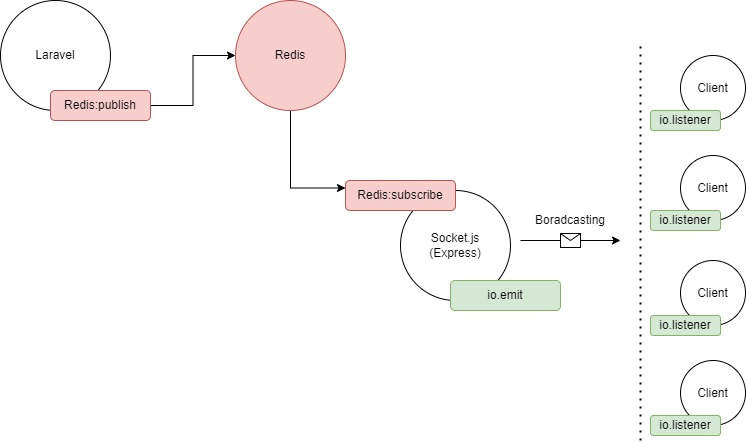
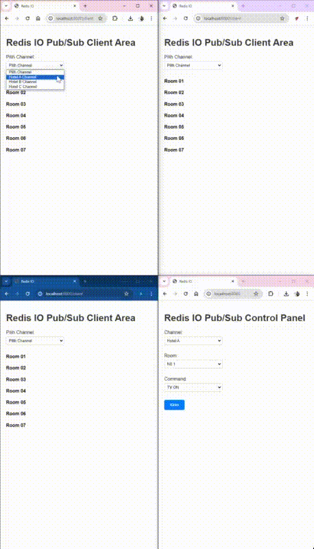

# LaraSocketIO with Redis

<p align="center">
  
  
  
</p>

Aplikasi ini merupakan contoh implementasi Laravel dengan Redis dan Socket.IO. Membuat aplikasi real-time yang responsif dan efisien.

## Alur Schema



## Langkah-langkah Penggunaan

### 1. Instalasi Dependensi

```bash
composer install
npm install
```

### 2. Jalankan Redis Server

Pastikan Redis sudah terpasang, kemudian jalankan server dengan perintah:

```bash
redis-server
```

### 3. Jalankan Socket.IO

Jalankan server Socket.IO dengan perintah:

```bash
node socket.js
```

### 4. Jalankan Laravel Server

Terakhir, jalankan server Laravel dengan perintah:

```bash
php artisan serve
```

## Tahap Uji Coba

Setelah tahap persiapan selesai, sekarang saatnya untuk menguji aplikasi ini.

### Langkah 1: Buka Browser Chrome

Buka browser Chrome dengan dua profile yang berbeda.

### Langkah 2: Buka URL Admin

Di salah satu browser, buka URL admin:

[http://localhost:8000/admin](http://localhost:8000/admin)

### Langkah 3: Buka URL Client

Di browser lain, buka URL client:

[http://localhost:8000/client](http://localhost:8000/client)

### Tampilan Uji Coba



Dengan langkah-langkah di atas, Anda sekarang dapat menguji aplikasi LaraSocketIO with Redis. Selamat mencoba! 🚀
